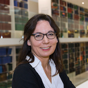

Marion Smits is associate professor and neuroradiologist at Erasmus MC, Rotterdam (NL), and honorary consultant and reader at University College London Hospital NHS Foundation Trust in London (UK). She combines  research with clinical work, with a particular focus on neurodegenerative disease within the [Alzheimer Centre Rotterdam](http://www.erasmusmc.nl/alzheimercentrum/), and on neuro-oncology in the [Brain Tumour Centre](https://www.erasmusmc.nl/hersentumorcentrum/), Rotterdam (NL).  

Marion is principal investigator of applied physiological MR neuroimaging at Erasmus MC. This research line is focused on the non-invasive, in vivo visualisation of the human brain’s function and (micro)structure under physiological and particularly pathological conditions. The clinical applicability and implementation of functional MR neuroimaging techniques and their findings are an important aspect of her research line. This means that she closely collaborates, both nationally and internationally, with a variety of clinicians such as neurologists, neuro-oncologists, neurosurgeons, rehabilitation physicians, (neuro)psychologists, and psychiatrists.  
Her research group consists of 1 post-doctoral researcher, 5 PhD students, 2 MSc students, and she supervises the research MR radiographer’s team that performs all functional scanning.  
She has a key position in several international research organisations, including the European Organisation for Research and Therapy in Cancer (EORTC) and COST-AID action BM1103 Arterial Spin Labelling in dementia with the  ultimate aim to provide imaging markers of brain physiology and disease that are directly clinically applicable. 
