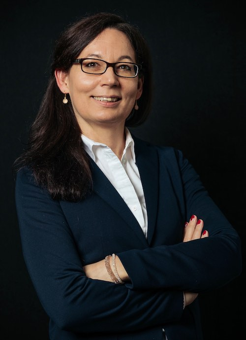

Marion Smits is full professor and chief of neuroradiology at Erasmus MC - University Medical Centre Rotterdam (NL). She combines  research with clinical work as a neuro- and head & neck radiologist, with a particular focus on neuro-oncology in the [Brain Tumour Centre](https://www.erasmusmc.nl/hersentumorcentrum/) at the Erasmus MC Cancer Institute, Rotterdam (NL). 

Marion also holds an honorary appointment as Professor of Neuroradiology at Delft University of Technology (TU Delft) Faculty of Applied Sciences, as well as a [Medical Delta Professorship](https://www.medicaldelta.nl/en/news/portrait-and-video-marion-smits-it-s-important-that-research-and-innovations-also-land-in-practice) with the aim to advance technological innovations in healthcare. See more about her work and vision:

<iframe width="520" height="292" src="https://www.youtube.com/embed/Uh0PP_RP5_Q?controls=0" title="Introduction Medical Delta professor Marion Smits" frameborder="0" allow="accelerometer; autoplay; clipboard-write; encrypted-media; gyroscope; picture-in-picture" allowfullscreen></iframe>

 Marion is Chair of Research and International Relations and board member of the Radiological Society of the Netherlands, and Past-Chair of the Brain Tumour Group Imaging Committee of the [European Organisation for Research and Treatment of Cancer (EORTC)](http://www.eortc.org). She is former President of the [European Society for Magnetic Resonance in Medicine and Biology (ESMRMB)](https://www.esmrmb.org) (2020) and of the Dutch Society of Neuroradiology (2018-2021). From 2019 to 2025 she served on the Executive Council of the [European Society of Radiology (ESR)](myesr.org) as elected Chair of Publications (2019-2022) and Chair of Research (2022-2025).

Marion's research line is focused on the non-invasive, <i>in vivo</i> visualisation of the human brain’s function and (micro)structure under physiological and particularly pathological conditions. She held her inaugural lecture entitled ['The Image that Counts'](https://www.youtube.com/watch?v=NuPW2FBd6p0&t=19s) on 14 June 2019. 
 She is a strong supporter of open science, publishing her work open access and sharing research data for further use. The 'Erasmus MC Glioma Database' (EGD) which includes imaging data as well as genetic status of over 700 patients with glioma was [published](https://www.sciencedirect.com/science/article/pii/S2352340921004753?via%3Dihub) in 2021. This publicly available database formed the basis for the [largest study to date of predicting glioma genotype and grade using deep learning](https://arxiv.org/pdf/2010.04425.pdf).

Marion is dedicated to breaking down the boundaries between the research arena and clinical practice and vice versa, by disseminating knowledge and insight gained from her research and by clinical implementation of physiological MR neuroimaging through her numerous teaching activities and leadership positions. Marion is permanent faculty of the European School of MRI and the European Course of Neuroradiology, and a frequent lecturer at international congresses such as ECR, RSNA, and ESNR. She organised numerous courses on advanced neuroimaging. 

Marion was Visiting Professor at Johns Hopkins Medical Institution - Department of Neuroradiology in 2015, and gave the 20th annual Henry M. Selby, MD, FACR Young Investigators Lecture at Memorial Sloan Kettering Cancer Center in 2018. In 2020, she was awarded the honorary membership of the American Society of Neuroradiology in recognition of her extraordinary contributions to the field of neuroradiology. In 2021, she was named 'most influential radiology researcher' by [AuntMinnie Europe](https://www.auntminnieeurope.com/index.aspx?sec=sup&sub=mri&pag=dis&ItemID=619843). She was awarded senior fellowship of both the [ESMRMB](https://www.esmrmb.org/society/honorary-members-fellows/) and the [International Society of Magnetic Resonance in Medicine (ISMRM)](https://www.ismrm.org/22m/fellows/) in London in 2022 for her pioneering work at the interface of technical innovation and clinical neuroradiology. 

For a full overview see Marion's [CV](https://marionsmits.net/curriculum-vitae) and [list of publications](https://scholar.google.nl/citations?hl=en&user=RjZ6HdkAAAAJ&view_op=list_works&citft=1&citft=2&email_for_op=marion.smits%40gmail.com&sortby=pubdate).
